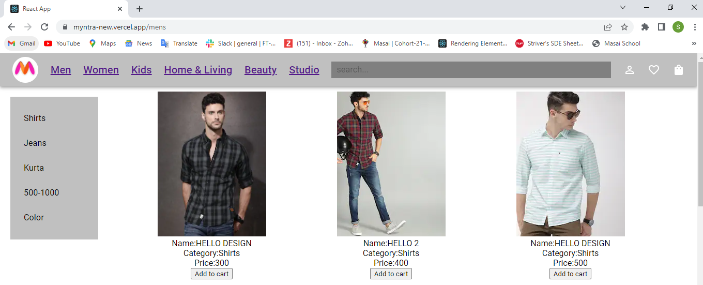

Clone Myntra.com

This is the clone of Myntra.com.
```
Disclamer:This Clone is used for only Educational Purposes.
```

## Screenshots





## Technologies Used

- React
- JSON-Server
- Material-Ui
- HTML
- CSS
- Import Export Modules


## Getting Started :

Prerequisites

- VS Code
  Installation
- Clone the repository
  ```
  Git Clone - https://github.com/shubhamkr0412/Myntra-clone
  ```
- Open the Project directory in terminal
  ```
  npm start
  ```
- Open Browser and use this URL
  ```
  http://localhost:3000/
  ```


## Authors
- [Shubham Kumar](https://github.com/shubhamkr0412)